# YuvaNext Canonical User Flow

## Purpose

This document translates the authoritative YuvaNext PRD into the canonical product user flow. It uses `YuvaNext_Prototype.html` as a concept and interaction reference, but the prototype does not override the PRD.

Source priority:

1. `DECISIONS.md` when available.
2. `SAFETY.md` for every safety behavior and message.
3. `prd-phase1.md.docx` and its Phase 2 addendum.
4. Approved assessment/data assets and versioned contracts.
5. `YuvaNext_Prototype.html` as a non-production visualization reference.

Related documents:

- [System and AI workflow](../architecture/yuvanext-system-workflow.md)
- [Five-module POC plan](../poc/README.md)
- [Tamil PRD explanation](../../yuvanext-prd-tamil.md)

## Review method and limitation

The prototype source, state variables, persona branches, UI functions, maps, report, safety demo, degraded mode, and counselor views were reviewed. The in-app browser was unavailable during this review, so visual layout, animation quality, responsive behavior, focus order, and actual click behavior remain unverified. Findings below distinguish source-confirmed behavior from visual QA that must still be performed.

---

## 1. What the prototype understands correctly

The prototype is a strong concept demonstration of these PRD ideas:

- A left-side conversational journey plus right-side visual canvas.
- Explorer, Pathfinder, and Launcher personas.
- Pre-OTP name, age, city, and state capture.
- Student OTP followed by guardian-consent handling for minors.
- A visible guardian-pending banner and ephemeral-mode concept.
- Word versus photo interest-quiz choice for Explorer/Pathfinder.
- Live RIASEC bars during assessment.
- Separate reveal, exploration, map, and report states.
- Career, college, and scholarship three-ring map concepts.
- Central identity bubble with name, code, code names, and qualities.
- Career detail cards with salary caveat, skills, progression, and plan link.
- A five-step journey breadcrumb.
- A full report card and privacy-safe share-card concept.
- Claude/API-down degraded mode concept.
- A safety interrupt using human-approved copy and counselor handoff.
- A read-oriented counselor session list, profile packet, and queue.
- Phase 2 Tamil, NCO, college expansion, aid freshness, and aptitude gates presented as previews.

These concepts should be retained in the React/Vite implementation.

---

## 2. Prototype simplifications that must not become production behavior

| Area              | Prototype behavior                                  | Canonical PRD behavior                                                             | Priority |
| ----------------- | --------------------------------------------------- | ---------------------------------------------------------------------------------- | -------- |
| Under-12          | Persona buttons only expose ages 14/17/22           | Explicit under-12 stop with no personal-data persistence                           | P0       |
| Stage routing     | Persona determines segment                          | Age plus self-described stage; stage can override age                              | P0       |
| City              | Fixed chips                                         | Free text with selected-state district autosuggest                                 | P1       |
| Other state       | Demo silently replaces it with Tamil Nadu           | Keep real state; offer generic guidance and do not misrepresent location           | P0       |
| OTP               | Pre-filled simulated number/code                    | Validation, expiry, attempts, resend, lock, anonymous-session merge                | P0       |
| Guardian consent  | Simulated approve/pending choice                    | Guardian phone, different-number validation, OTP/SMS, decline and seven-day expiry | P0       |
| Pending responses | In-memory concept                                   | IndexedDB/ephemeral queue; server must reject persistence until consent            | P0       |
| Intake            | Explorer 3, Pathfinder 4, Launcher 4 demo questions | Versioned 5/7/9 question sets                                                      | P0       |
| Word assessment   | 12 demo items                                       | Mini-IP-30 for Explorer; IP-60 for Pathfinder/Launcher                             | P0       |
| Photo assessment  | 8 emoji pairs                                       | 16 reviewed/commissioned or CC0 photo pairs                                        | P0       |
| Batch delivery    | One item at a time, halfway message                 | Fixed database order; batches of 5 Explorer and 10 otherwise                       | P0       |
| Response capture  | Local score update only                             | Idempotent response record with latency, retry queue, and reconnect flush          | P0       |
| QC                | Not implemented                                     | Inject QC items at required positions; failure creates `confidence=soft` only      | P0       |
| Tie-break         | Simple score sort                                   | Four tie-break items when rank 3/4 gap ≤2, then fixed fallback order               | P0       |
| Resume            | Not implemented                                     | Exact next item within 14 days; continue/restart after 14 days                     | P0       |
| Pathfinder stack  | Interest quiz plus 3-question demo aptitude         | Interest reveal, optional WIP, optional 12-item aptitude sample                    | P0       |
| Launcher stack    | One 12-item interest demo                           | IP-60 → reveal → WIP → reveal → Mini-IPIP → reveal                                 | P0       |
| Reveal nuance     | Uses top-two gap ≤2                                 | Nuance note when top-two gap ≤3                                                    | P1       |
| Recommendations   | Hard-coded persona/code maps                        | Versioned deterministic engine over verified database records                      | P0       |
| Career rings      | Hard-coded arrays                                   | One `match_careers(maxResults=18)` result, deterministic partition and invariants  | P0       |
| College rings     | Curated hard-coded examples                         | `get_colleges` candidates plus deterministic discipline/tier/proximity ranking     | P0       |
| Scholarship rings | Pre-assigned ring numbers                           | Stored facts determine likelihood; unknown facts push outward                      | P0       |
| Free chat         | Keyword templates                                   | Claude tool loop plus same-turn entity grounding and safe fallback                 | P0       |
| Report step       | End-of-guidance helper marks all steps done         | Step 5 fires only after report/card interaction completes                          | P0       |
| Report language   | Hard-coded `English`                                | Record actual instrument language and word/photo variant                           | P1       |
| Counselor writes  | Retake override button appears                      | Phase 1 dashboard is read-only except queue mark-as-actioned                       | P0       |
| Salary/aid data   | Large embedded demo dataset                         | Only reviewed/source-versioned database fields may be student-facing               | P0       |
| Phase 2 previews  | Available through demo controls                     | Feature-flagged; Tamil requires native review and approved safety copy             | P0       |

The demo's `fastForward()` uses random values. That is acceptable as a demonstration shortcut but must never be used as evidence that production scoring or recommendations are deterministic.

---

## 3. Canonical end-to-end journey

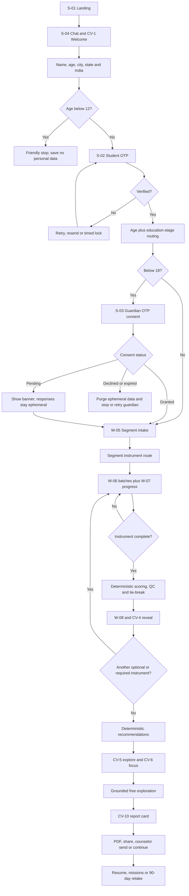

### Global interrupt

`W-16 Safety` can interrupt every state from onboarding through free chat. It pauses the active state, shows approved copy, and creates the required handoff/alert. Safety does not wait until the AI-counselor stage.

---

## 4. Entry, onboarding, and routing flow

### 4.1 Landing

Display:

- YuvaNext value proposition.
- Primary `Start — it is free` action.
- Trust markers: privacy, exploration rather than verdict, no exact marks required.
- Returning-user action.
- Degraded-mode banner if conversational AI is unavailable; Start remains enabled.

Transition:

- New user → anonymous session → S-04.
- Returning user → S-02 OTP → return-flow decision.

### 4.2 Pre-OTP questions

Order:

1. First name.
2. Age.
3. City/town.
4. State.
5. Country displayed as India.

Rules:

- Only an anonymous session row exists server-side before OTP.
- City is free text with district autosuggest based on state.
- Five southern states appear as primary chips.
- `Other Indian state` expands to the complete list.
- A non-India visitor may continue with generic guidance; do not pretend their state is Tamil Nadu.
- Age below 12 causes a warm stop and purge/no-save.

### 4.3 OTP

States:

- Phone entry.
- Code sent with 30-second resend timer.
- Wrong code.
- Expired code after 5 minutes.
- Locked after 3 attempts for 30 minutes.
- Resend limit reached after 3 resends.
- Verified and anonymous-session merge complete.

### 4.4 Segment route

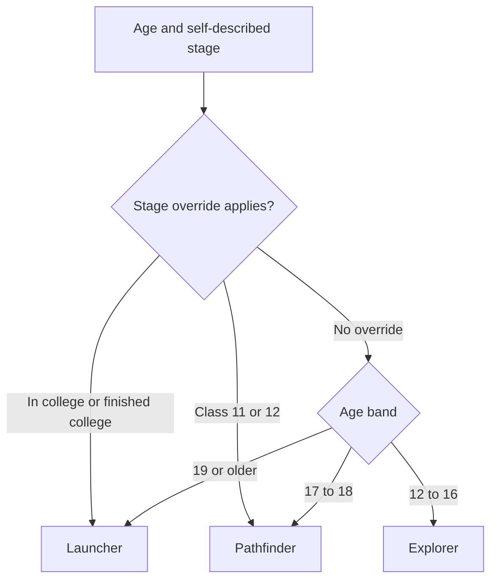

Both age and self-stage are stored. The confirmation message explains the selected track without presenting it as a permanent identity.

---

## 5. Guardian-consent flow

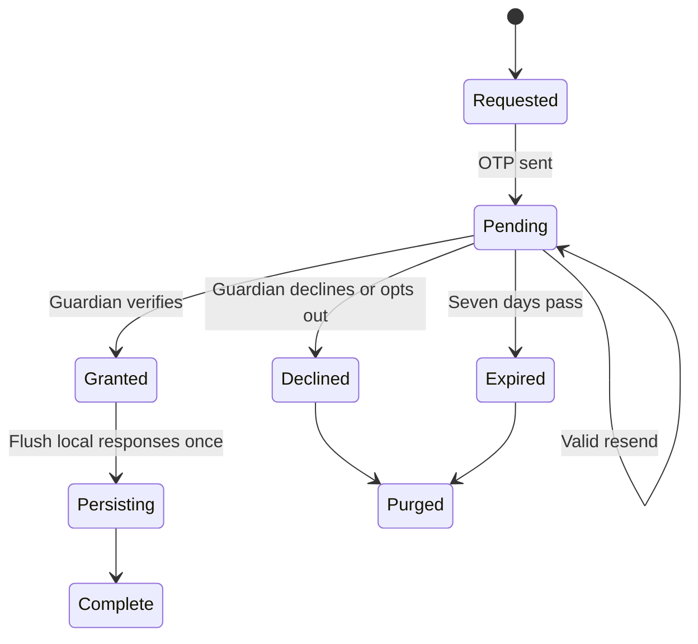

Required interaction:

1. Explain why consent is needed.
2. Ask for guardian phone.
3. Reject the student's own phone number.
4. Send OTP and one-line explanation SMS.
5. Offer `Continue while we wait`.
6. While pending, show the persistent banner and store assessment answers only in the approved ephemeral browser store.
7. On grant, flush responses idempotently and clear the banner.
8. On decline/expiry, purge and provide a kind stop/retry path.

Intake answers that would be sensitive personal data must follow the approved consent/persistence policy, not merely the assessment-answer policy.

---

## 6. Intake flows

All intake questions are versioned, one per chat turn, and use chips whenever values are enumerable.

### Explorer — 5 questions

The exact five questions come from the approved Blueprint/copy assets. The prototype currently demonstrates board, favorite subject, and lose-track-of-time; two approved questions remain to be represented.

### Pathfinder — 7 questions

The exact seven questions come from the approved Blueprint/copy assets. The prototype demonstrates stream, marks band, exams, and study distance; three approved questions remain.

### Launcher — 9 questions

The exact nine questions come from the approved Blueprint/copy assets. Aid interest is Q9 and sets `wantsAid`. Aid results appear only after assessment.

Shared rules:

- Sensitive questions offer `Prefer not to say`.
- Exact marks are never collected.
- Each answer receives a short acknowledgment.
- Canvas `CV-2` accumulates approved fact chips.
- Stepper remains at Step 1 until the first assessment item begins.

---

## 7. Instrument routing

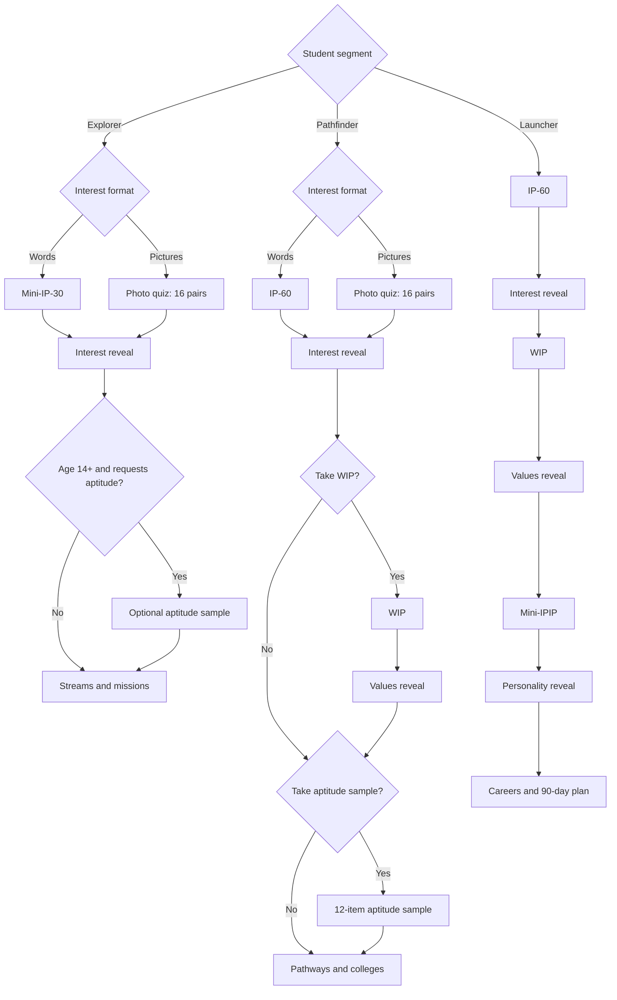

Declining an optional instrument must not block later guidance.

The Phase 1 aptitude sample is 12 items. The Phase 2 full battery is 24 items and must obey the local-norm gate. These must have different instrument/config versions so the UI cannot confuse them.

---

## 8. Assessment execution flow

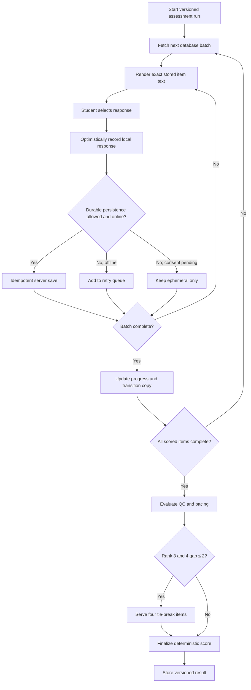

Required behavior:

- Explorer batches: 5.
- Other batches: 10.
- Progress uses actual scored plus required extension count.
- QC appears at specified positions but is not identified to the student.
- Median batch latency below 800ms produces at most one gentle nudge per instrument.
- QC failure never rejects the result; it sets `confidence=soft`.
- Past batches are read-only.
- Pause saves position.
- Resume restores the exact next unanswered item.
- After 14 days, offer continue or restart.

---

## 9. Reveal flow

The interest reveal is six separate chat messages:

1. Code headline.
2. Per-letter explanation grounded in the student's intake facts.
3. Three career vignettes from different approved education routes.
4. Nuance note only when top-two gap is ≤3.
5. Privacy-safe share offer.
6. Next-step choice.

Canvas moves from `CV-3` live bars to `CV-4` reveal only after the scoring service returns a final result. AI may explain the result but cannot calculate or rewrite it.

For `confidence=soft`, wording is appropriately hedged and the counselor packet receives the flag.

---

## 10. Segment guidance flows

### Explorer

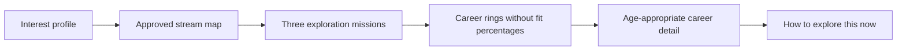

### Pathfinder

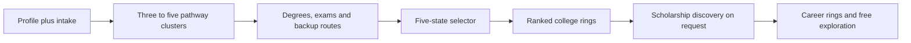

### Launcher

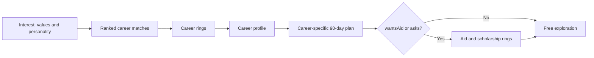

Rules common to all segments:

- Every entity is a database ID from a same-turn tool/recommendation result.
- Every recommendation has stored fit explanation.
- Feasibility is framed as direct versus resilient route.
- Salary is never a matching factor.
- List view exposes the full ranked data and supports assistive technology.

---

## 11. Ring-map flows

### Career map

1. Call `match_careers(maxResults=18)` once.
2. Partition in deterministic code.
3. Inner 3–4: highest fit with top-letter high point.
4. Middle 5–6: related domain or RIASEC adjacency.
5. Outer 5–6: second/third letters or cross-domain discovery.
6. Guarantee vocational/diploma and unexpected discovery candidates when the approved result set contains them.
7. Tap opens career profile/focus using the same entity record.

### College map

1. Retrieve candidate colleges for pathway/discipline and state context.
2. Rank discipline match → tier → state proximity → stable name order.
3. Inner: selected/home-state best.
4. Middle: next in-state and strong neighboring-state options.
5. Outer: other southern states, vocational/polytechnic/ITI, and open/distance routes.
6. Tap opens source-aware college detail and verification caveat.

### Scholarship map

1. Retrieve candidate schemes using stored/volunteered facts.
2. Determine `likely`, `check conditions`, or `explore` in code.
3. Missing facts push outward.
4. Never label a scheme guaranteed.
5. Tap opens stored provider, amount, window, official URL, minimum eligibility, freshness, and yearly-change caveat.

---

## 12. Grounded free-chat flow

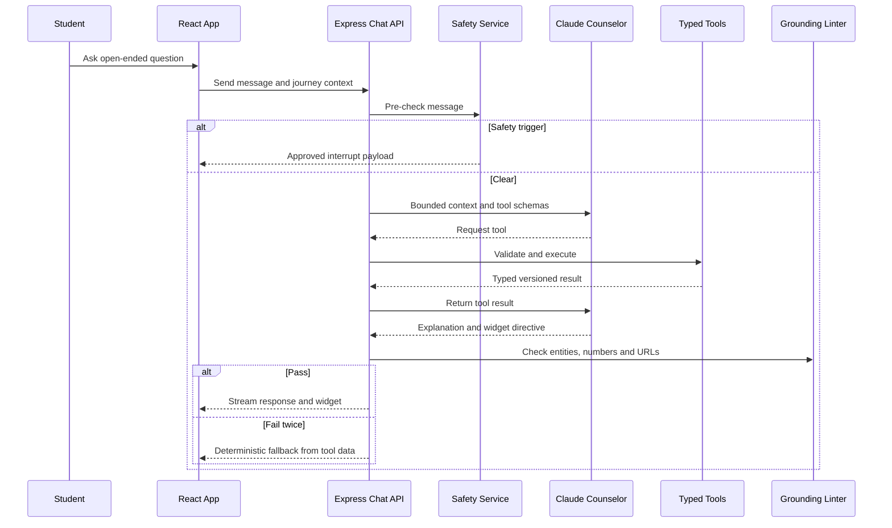

The prototype's keyword templates are acceptable mocks for POC UI development. They are not the production AI workflow.

---

## 13. Report and share flow

### Report entry

Report may be opened from:

- End-of-guidance CTA.
- `My report card` chip.
- Grounded `report` intent.

### Snapshot assembly

Use only:

- Stored profile snapshot.
- Stored assessment results and variants.
- Stored recommendation snapshots.
- Stored explored/selected entity tap log.
- Deterministic summary fragments.

Do not calculate a new match during render.

### Report order

1. Profile.
2. Assessment.
3. Explored/selected options.
4. Deterministic two-to-three-sentence summary with growth framing.
5. Actions: private PDF, privacy-safe share card, consent-gated counselor send, continue.

### Stepper correction

Step 5 becomes complete only after the report/card interaction completion event. Finishing guidance or enabling free text is not enough.

### Share card

Allowed:

- First name.
- Code.
- Code name.
- YuvaNext branding.

Forbidden:

- Age.
- Phone.
- School.
- City/state.
- Raw scores.
- Career/college/scholarship selections.

---

## 14. Return and retake flow

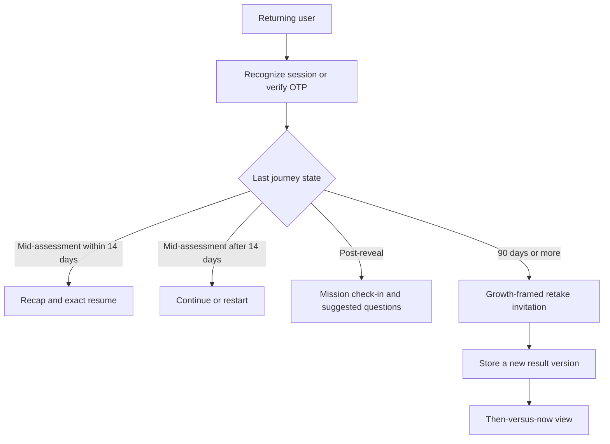

Within 90 days, show cooldown copy. A counselor-approved override may exist in backend operations, but the Phase 1 read-only dashboard should not expose an unsupported edit control.

---

## 15. Safety flow

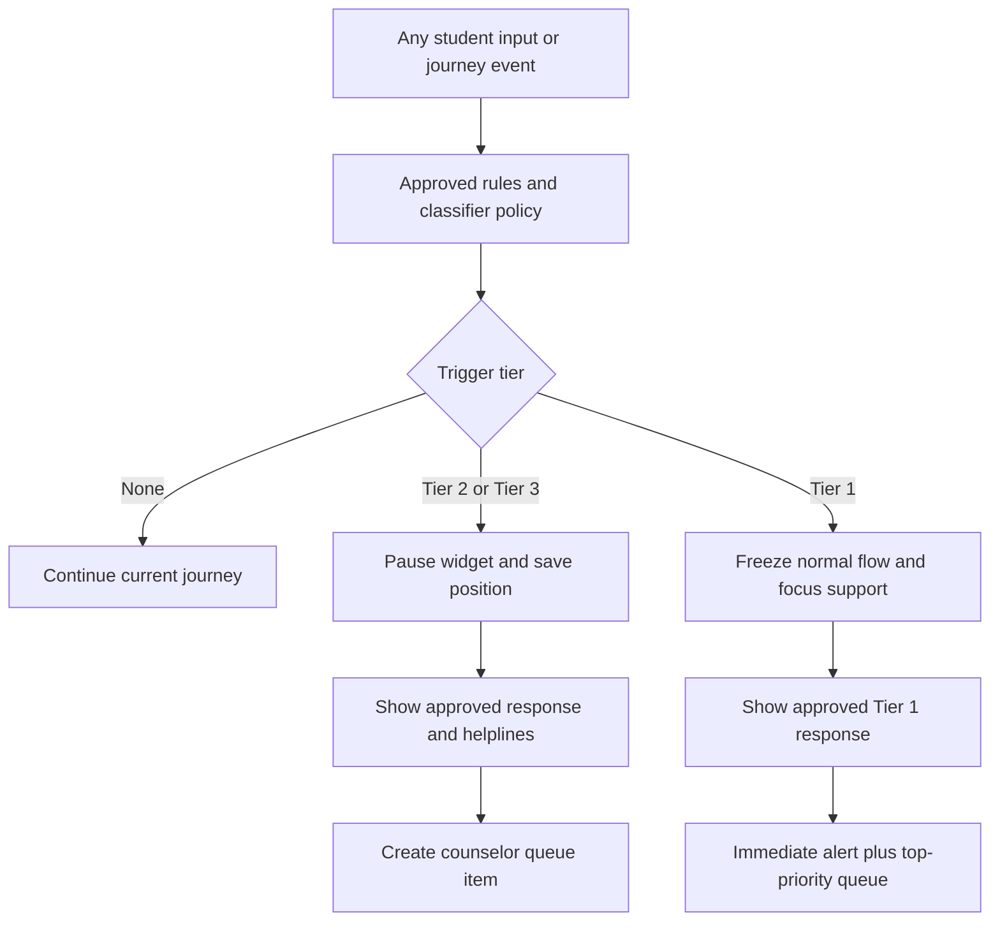

The safety demo communicates the intended concept. Production must add:

- Real detection before normal-model processing.
- Tier-specific continuation rules.
- Immutable restricted safety event.
- Alert delivery status.
- Counselor action and audit.
- Exact copy from signed `SAFETY.md`.

---

## 16. Counselor flow

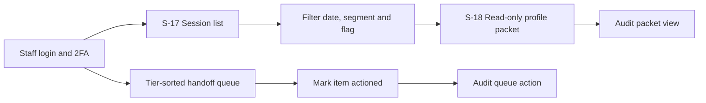

Profile packet includes:

- Intake summary.
- Results and confidence.
- Recommendations and versions.
- Conversation excerpts only for safety/handoff-flagged sessions.

Phase 1 permitted write:

- Queue mark-as-actioned.

Not permitted in the Phase 1 dashboard unless the PRD is consciously amended:

- Editing scores.
- Editing recommendations.
- Editing weights.
- Direct profile edits.
- Retake-override button.
- Arbitrary conversation access.

An analytics overview may remain a read-only addition if product ownership accepts it and it contains no PII.

---

## 17. Canvas and stepper state mapping

| Journey event                     | Stepper                      | Canvas state                            |
| --------------------------------- | ---------------------------- | --------------------------------------- |
| Landing                           | Hidden or Step 1 pending     | `CV-1 Welcome`                          |
| First onboarding/intake prompt    | Step 1 current               | `CV-2 Profile`                          |
| First assessment item rendered    | Step 2 current               | `CV-3 Live interest map`                |
| Final interest result revealed    | Step 3 current               | `CV-4 Reveal`                           |
| First guidance/map rendered       | Step 4 current               | `CV-5 Explore map`                      |
| Bubble selected                   | Step 4 current               | `CV-6 Focus` / `CV-7` / `CV-8` / `CV-9` |
| Report/card interaction completes | Step 5 complete              | `CV-10 Report card`                     |
| Safety interrupt                  | Normal stepper hidden/frozen | `W-16 priority state`                   |

Rules:

- Canvas never advances the journey by itself.
- Bubble taps explore inside the current step.
- Completed step tap scrolls chat to recap.
- Upcoming steps are not clickable.
- State persists across resume.
- Mobile collapses to `Step n of 5 · label`.

---

## 18. Error and degraded states

| Failure                              | Required user behavior                                                                                 |
| ------------------------------------ | ------------------------------------------------------------------------------------------------------ |
| Claude unavailable                   | Continue assessment, scoring, reveal, maps, static top-five, and report; free chat shows retry message |
| Network loss during assessment       | Optimistic next item, local retry queue, non-blocking status, flush on reconnect                       |
| OTP provider failure                 | Apply documented fallback provider/retry behavior                                                      |
| Guardian approval arrives mid-run    | Flush ephemeral responses once and clear banner                                                        |
| Catalog query empty                  | Say no approved result is available and offer filters/alternatives                                     |
| Unverified college                   | Show confirm-details caveat                                                                            |
| Aid record stale/deactivated         | Apply freshness policy; never render deactivated record                                                |
| Claude introduces unsupported entity | Regenerate once, then template fallback                                                                |
| PDF/share render fails               | Keep report visible and allow retry without recomputing data                                           |

---

## 19. Phase 1 versus Phase 2 visibility

### Phase 1

- English UI.
- 12-item aptitude sample where offered.
- Five-state seed college directory.
- Seed aid catalog.
- No NCO merge requirement.
- No locally normed full aptitude bands.

### Phase 2 feature flags

- Tamil toggle and bilingual assessment mode.
- Approved Tamil item/copy fallback tracking.
- NCO/ISCO career mappings.
- Expanded AISHE/state college coverage and district filter.
- Annual aid freshness behavior.
- 24-item aptitude battery with local-norm gate.
- Then-versus-now retest view.
- Pilot cohort/A-B/export instrumentation.

The prototype may retain Phase 2 demo controls, but every such control must be labeled preview and separated from the Phase 1 acceptance demonstration.

---

## 20. Correct POC demonstration script

### Demo A — Explorer minor

1. Show under-12 no-save branch.
2. Restart as age 14 Explorer.
3. Complete details, OTP, and guardian pending.
4. Answer one batch offline while responses remain ephemeral.
5. Grant guardian consent and show one-time sync.
6. Complete Mini-IP-30 or photo-16 fixture with QC/tie behavior.
7. Reveal code, streams, missions, career rings, detail, and report.
8. Verify Step 5 only after report interaction.

### Demo B — Pathfinder

1. Use age/stage routing boundary fixture.
2. Complete 7-question intake.
3. Choose IP-60 or photo quiz.
4. Reveal, optionally take WIP and aptitude sample.
5. Show pathways, state selection, college rings, backup route, and scholarships.
6. Ask a free-text comparison and show same-turn tools/grounding.

### Demo C — Launcher

1. Complete 9-question intake including aid interest.
2. Complete IP-60, WIP, and Mini-IPIP with reveals.
3. Show career ranking, rings, profile, and 90-day plan.
4. Show aid only because requested.
5. Generate report and privacy-safe share card.

### Demo D — Safety and failure

1. Interrupt an active assessment with an approved Tier fixture.
2. Show saved position, queue event, alert state, and counselor action.
3. Disable Claude and complete static guidance/report.
4. Inject unsupported entity output and show linter fallback.

---

## 21. Visual QA still required

When the browser surface is available, verify:

- Desktop split ratio and canvas overflow.
- Mobile stacking at 899px and 360px width.
- OTP/consent modal focus trapping and escape behavior.
- Keyboard operation for every chip, Likert choice, bubble/list toggle, and action.
- Screen-reader reading order.
- No overlapping ring bubbles or clipped career cards.
- Report scrolling, print/PDF layout, and long names.
- Tamil glyph rendering and bilingual item layout in preview mode.
- Safety state contrast, focus placement, and prevention of accidental dismissal.
- Counselor table horizontal overflow and drawer focus management.

---

## 22. Final product rule

The prototype should teach stakeholders what YuvaNext feels like. The production flow must additionally prove what YuvaNext guarantees:

> The conversation may feel flexible, but identity, consent, assessment, scoring, recommendations, safety, privacy, and audit behavior are controlled by deterministic, versioned application rules.
